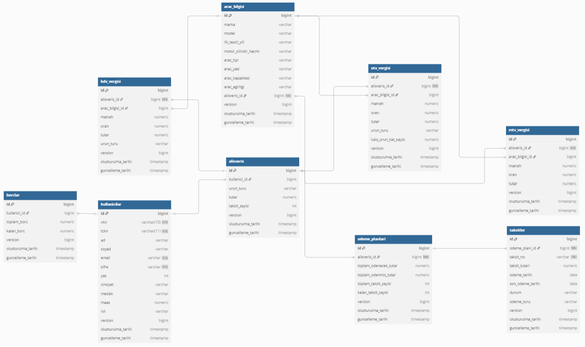
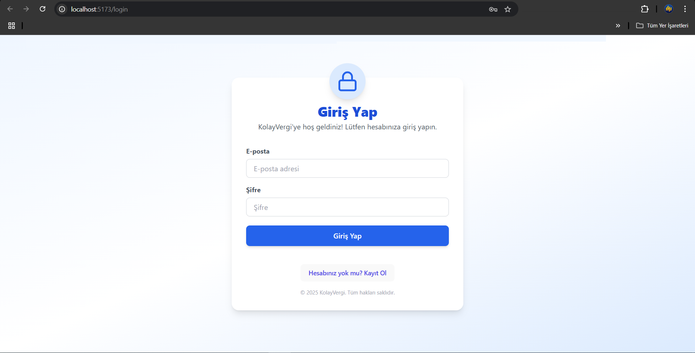
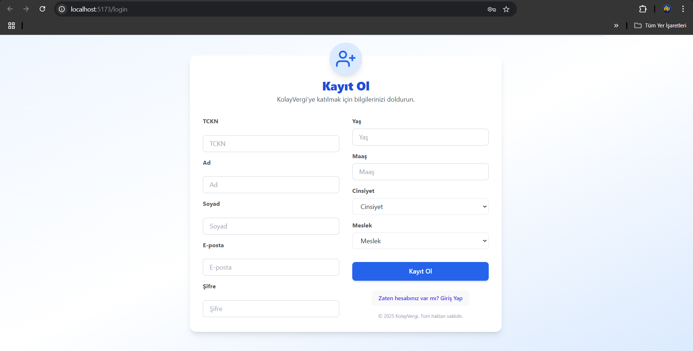
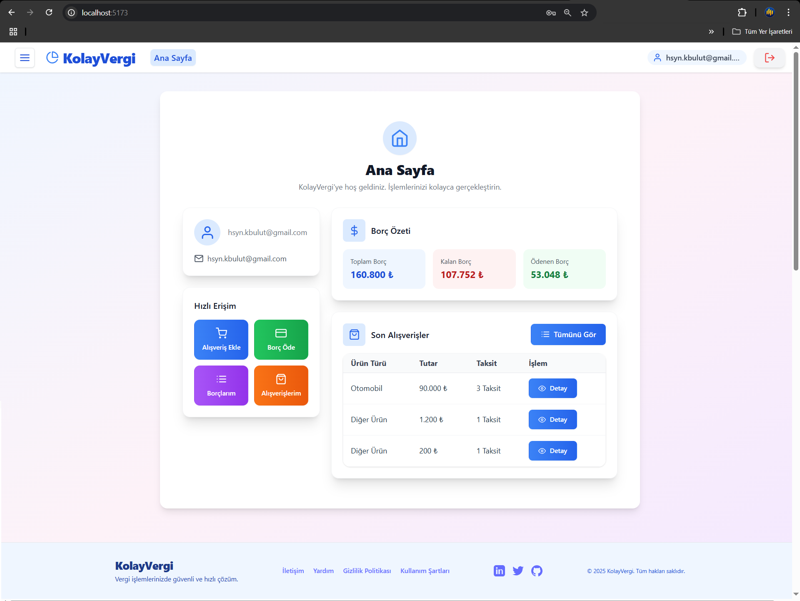
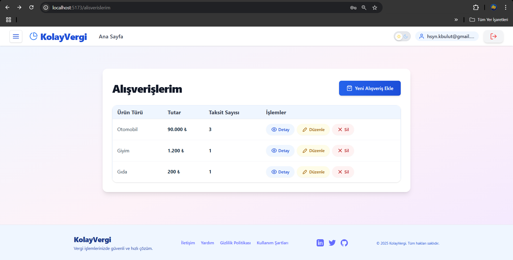
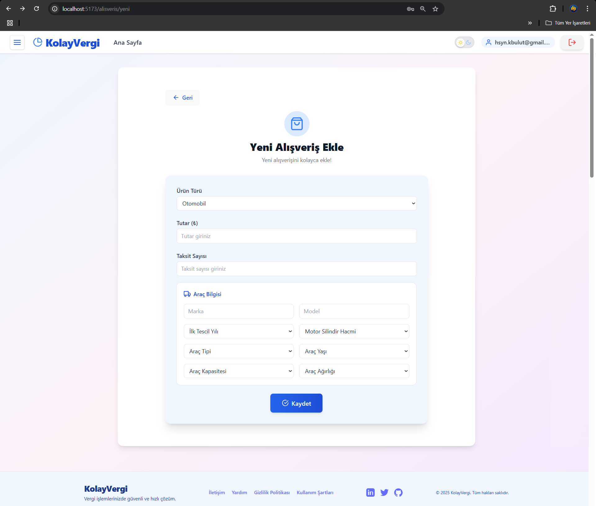
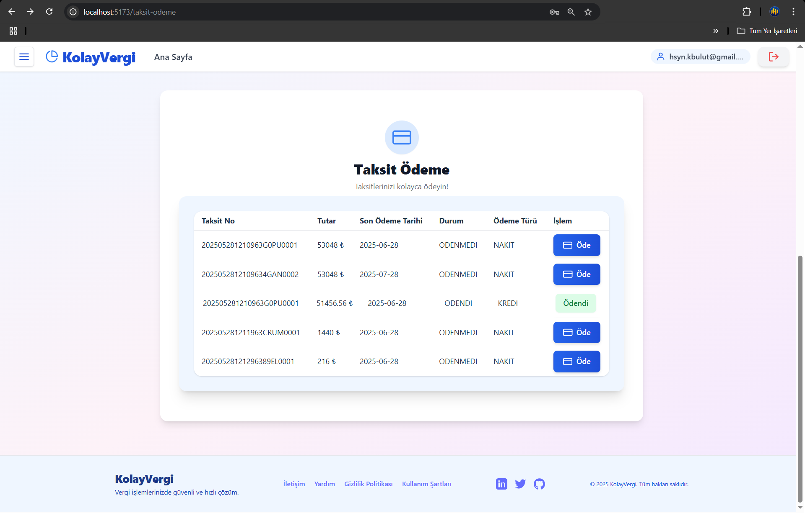
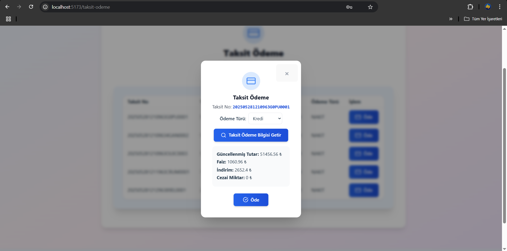
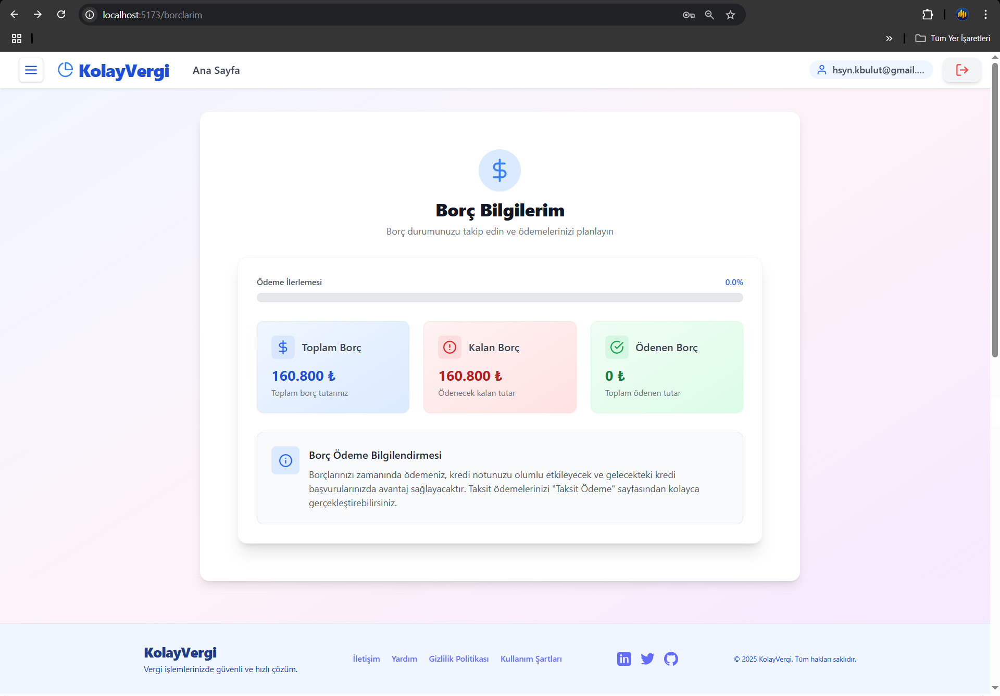

# KolayVergi

KolayVergi, vergi mükelleflerinin borç, taksit ve alışveriş işlemlerini kolayca yönetebilmesi için geliştirilmiş modern ve güvenli bir web uygulamasıdır. Amacı, kullanıcıların vergi ve borç takibini dijital ortamda hızlı, anlaşılır ve erişilebilir şekilde yapmasını sağlamaktır. Hem bireysel kullanıcılar hem de yöneticiler (admin) için uygundur.

---

## 🚩 Proje Hakkında Genel Bilgi

- **Amaç:** Vergi ve borç işlemlerini dijitalleştirerek kullanıcıların iş yükünü azaltmak, taksit ve ödeme süreçlerini kolaylaştırmak.
- **Çözdüğü Problem:** Klasik ve karmaşık vergi/borç takip süreçlerini sadeleştirir, kullanıcıya anlık ve güvenli erişim sunar.

---

## ⭐ Proje Özellikleri

- Kullanıcı ve admin rolleriyle giriş ve yetkilendirme
- JWT tabanlı güvenli oturum yönetimi
- Borç ve taksit takibi
- Alışveriş ve vergi işlemleri
- Taksit ödeme ve geçmiş görüntüleme
- Modern, responsive ve kullanıcı dostu arayüz


---

## 🛠️ Kullanılan Teknolojiler

### Frontend
- React.js (Vite ile hızlı geliştirme)
- Tailwind CSS
- React Router
- Axios

### Backend
- Java 21
- Spring Boot
- Spring Security & JWT
- PostgreSQL
- Swagger/OpenAPI (API dokümantasyonu)
- Docker & Docker Compose (çoklu servis yönetimi)
- pgAdmin (veritabanı arayüzü)

### Veritabanı
- **PostgreSQL** (JDBC ile bağlantı, Spring Data JPA ile yönetim)

---

## 📚 API Endpointleri (Özet Tablo)

| Yöntem | Endpoint                        | Açıklama                        | Kimler Erişebilir |
|--------|----------------------------------|----------------------------------|-------------------|
| POST   | /api/v1/auth/login              | Kullanıcı girişi                | Herkes            |
| POST   | /api/v1/auth/register           | Kayıt ol                        | Herkes            |
| POST   | /api/v1/auth/refresh            | Token yenileme                  | Herkes            |
| PUT    | /api/v1/auth/update             | Profil güncelleme               | Giriş yapmış      |
| GET    | /api/v1/kullanicilar            | Kullanıcı listesi (admin)       | Admin             |
| GET    | /api/v1/kullanicilar/{id}       | Kullanıcı bilgisi               | Admin/Kullanıcı   |
| DELETE | /api/v1/kullanicilar/{id}/delete| Kullanıcı sil                   | Admin/Kullanıcı   |
| POST   | /api/v1/alisverisler            | Alışveriş ekle                  | Kullanıcı         |
| GET    | /api/v1/alisverisler/{id}       | Alışveriş detay                 | Kullanıcı         |
| PUT    | /api/v1/alisverisler/{id}       | Alışveriş güncelle              | Kullanıcı         |
| DELETE | /api/v1/alisverisler/{id}       | Alışveriş sil                   | Kullanıcı         |
| GET    | /api/v1/borclar/{id}            | Borç detayları                  | Kullanıcı         |
| POST   | /api/v1/odemeler/taksit-odeme   | Taksit öde                      | Kullanıcı         |
| GET    | /api/v1/odemeler/{taksitNo}     | Taksit ödeme detayı             | Kullanıcı         |

---

## 🗂️ Veritabanı Şeması

  

---

## 🖼️ Kullanıcı Arayüzü (UI) Ekran Görüntüleri

- Giriş Ekranı
  

- Kayıt Ekranı
  

- Ana Sayfa
  

- Alışverişlerim
  

- Alışveriş Ekleme
  

- Alışveriş Detayı
  

- Taksitler
  

- Taksit Ödeme
  

- Borçlarım
  

---

## 🚀 Projenin Kurulumu (Kurulum Rehberi)

### 1. Projeyi Klonlayın
```bash
git clone https://github.com/your-username/kolayvergi.git
cd kolayvergi
```

### 2. Docker ile Hızlı Kurulum (Tavsiye Edilen)

#### Gereksinimler:
- Docker ve Docker Compose sisteminizde kurulu olmalı.

#### Adımlar:
1. **Backend .jar dosyasını oluşturun:**
   ```bash
   cd kolayvergi-backend
   ./mvnw clean package -DskipTests
   cd ..
   ```
   Bu komut sonunda `kolayvergi-backend/target/` klasöründe `.jar` dosyası oluşur.

2. **Tüm sistemi Docker Compose ile başlatın:**
   ```bash
   docker-compose up --build
   ```
   Bu komut ile aşağıdaki servisler birlikte ayağa kalkar:
   - Spring Boot backend
   - PostgreSQL veritabanı
   - pgAdmin veritabanı arayüzü

3. **Frontend'i ayrı başlatmak isterseniz:**
   ```bash
   cd kolayvergi-frontend
   npm install
   npm run dev
   ```

#### Notlar:
- pgAdmin arayüzüne erişmek için: `http://localhost:5050`
- Frontend varsayılan olarak `http://localhost:5173` adresinde çalışır.

---

### 3. Manuel Kurulum (Docker olmadan)

#### Backend
```bash
cd kolayvergi-backend
mvn install
mvn spring-boot:run
```

#### Frontend
```bash
cd kolayvergi-frontend
npm install
npm run dev
```

#### Veritabanı Ayarları
- PostgreSQL kurulu olmalı.
- `application.properties` dosyasında veritabanı bağlantı bilgilerinizi güncelleyin.

---

## 👥 Katkıda Bulunanlar / Takım Üyeleri

- **Hüseyin Karabulut**  
  [@hsynkbulut](https://github.com/hsynkbulut)  
  [LinkedIn](https://www.linkedin.com/in/hsynkbulut/)

- **Mustafa Fatih Güçlüer**  
  [@mfgucluer](https://github.com/mfgucluer)  
  [LinkedIn](https://www.linkedin.com/in/mfgucluer/)

---

## 📞 İletişim Bilgileri
- Hüseyin Karabulut: [hsyn.kbulut@gmail.com](mailto:hsyn.kbulut@gmail.com)
- Mustafa Fatih Güçlüer: [mfgucluer1@hotmail.com](mailto:mfgucluer1@hotmail.com)

- GitHub Issues üzerinden de soru ve önerilerinizi iletebilirsiniz.
---

## 📝 Lisans

Bu proje BSD 3-Clause License ile lisanslanmıştır. Detaylar için [LICENSE](LICENSE) dosyasına bakabilirsiniz.

---

## ⚠️ Önemli Notlar ve Yapılandırma Uyarısı

- `docker-compose.yml` dosyasındaki veritabanı adı, kullanıcı adı, şifre gibi ayarları kendi ihtiyacınıza göre değiştirebilirsiniz.
- **Dikkat:** Bu ayarların birebir aynısı `kolayvergi-backend/src/main/resources/application.properties` dosyasında da olmalıdır. Yani bir tarafta değişiklik yaparsanız, diğer tarafta da aynı değişikliği yapmalısınız. Aksi halde backend uygulaması veritabanına bağlanamaz.

---

## 📖 Swagger API Dokümantasyonu

Projede Swagger/OpenAPI ile otomatik API dokümantasyonu sağlanmaktadır.

- Swagger arayüzüne erişmek için backend çalışırken şu adresi kullanabilirsiniz:
  - [http://localhost:8080/swagger-ui/index.html](http://localhost:8080/swagger-ui/index.html)

Buradan API endpointlerini test edebilir ve dokümantasyonu inceleyebilirsiniz.
